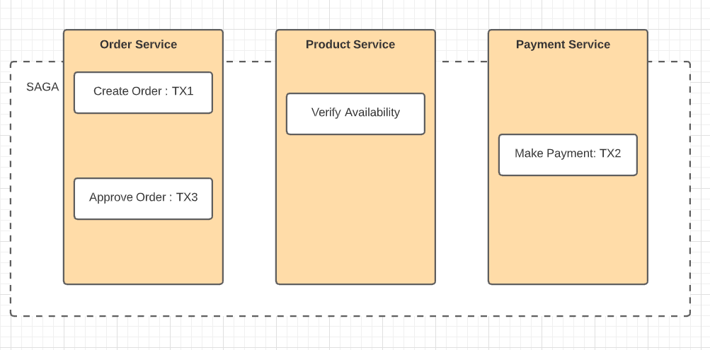
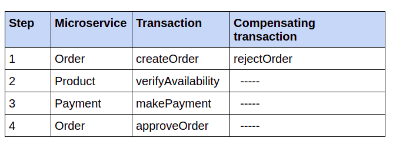

### Introduction

**ACID** (Atomicity, Consistency, Isolation, Durability) transactions greatly simplify the job of the developer by providing the 
illusion that each transaction has exclusive access to the data. In a microservice architecture, transactions that are within a
single service can still use ACID transactions. The challenge, however, lies in implementing transactions for operations that 
update data owned by multiple services as each microservice holds its own database.

Transactionality in microservice systems can be realized by applying some well-known design patterns like **SAGA**.
SAGA, a message-driven sequence of local transactions, to maintain data consistency across microservices. One challenge with sagas is that they are ACD (Atomicity, Consistency,Durability). They lack the isolation feature of traditional ACID transactions. Another
challenge is rolling back changes when an error occurs. 

A great feature of traditional ACID transactions is that the business logic can easily
roll back a transaction if it detects the violation of a business rule. It executes a ROLL-
BACK statement, and the database undoes all the changes made so far. Unfortunately,
sagas can’t be automatically rolled back, because each step commits its changes to the
local database.

SAGA pattern can be implemented in two different ways.
1. Choreography SAGA
2. Orchestration SAGA

### AN Example SAGA : Create Order SAGA
We look into Create Order operation using SAGA. When a user requests to createOrder/placeOrder, request first enters into Order Microservice which internally involves invoking other microservices. Below image shows the transactions involved in placing an Order.

**This SAGA consists of the following local transactions..**
- Order Microservice --> Create a order in APPROVAL_PENDING state
- Product Microservuce --> Verify for the availability of products
- Payment Microservice --> Making payment for the Order.
- Order Microservice --> Change the state of Order to APPROVED 

**Working of SAGA**
A service publishes a message when a local transaction completes. This message then triggers the next step in the saga. Not only does using messaging ensure the saga participants are loosely coupled, it also guarantees that a saga completes. That’s because if the recipient of a message is temporarily unavailable, the message broker buffers the message until it can be delivered.

**How SAGA handles ROLL_BACK transactions**
SAGAS use compensating transactions to ROLL_BACK changes. Our CreateOrder can fail due to..
- Products out of stock
- Error during payment process

If a local transaction fails, the SAGA’s coordination mechanism must execute compensating transactions that reject the Order. It’s important to note that not all steps need **compensating transactions**.The steps such as **makePayment** that are followed by steps that always succeed.

- Steps (1) and (2) are compensatable transactions because if any of then fails then we need to reject the order. 
- Step (3) is considered as pivot transaction because it is followed by the step that never fails.
- Step (4) is retrible transactions because they always succeed.

To see how compensating transactions are used, imagine a scenario where the payment process fails. In this scenario, the saga executes the following local transactions:
- Order Microservice --> Create a order in APPROVAL_PENDING state
- Product Microservuce --> Verify for the availability of products
- Payment Microservice --> Making payment for the Order. Fails
- Order Microservice --> Change the state of Order to REJECTED

**Fourth step** is compensating transaction that undo the updates made by Order Microservice. A saga’s coordination logic is responsible for sequencing the execution of forward and compensating transactions.

