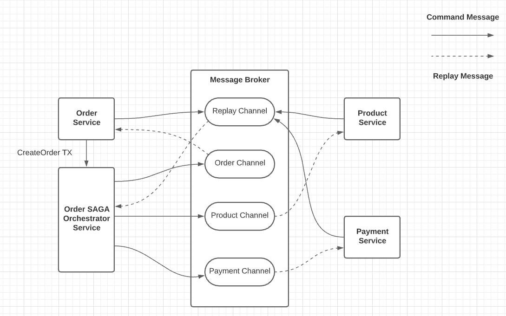
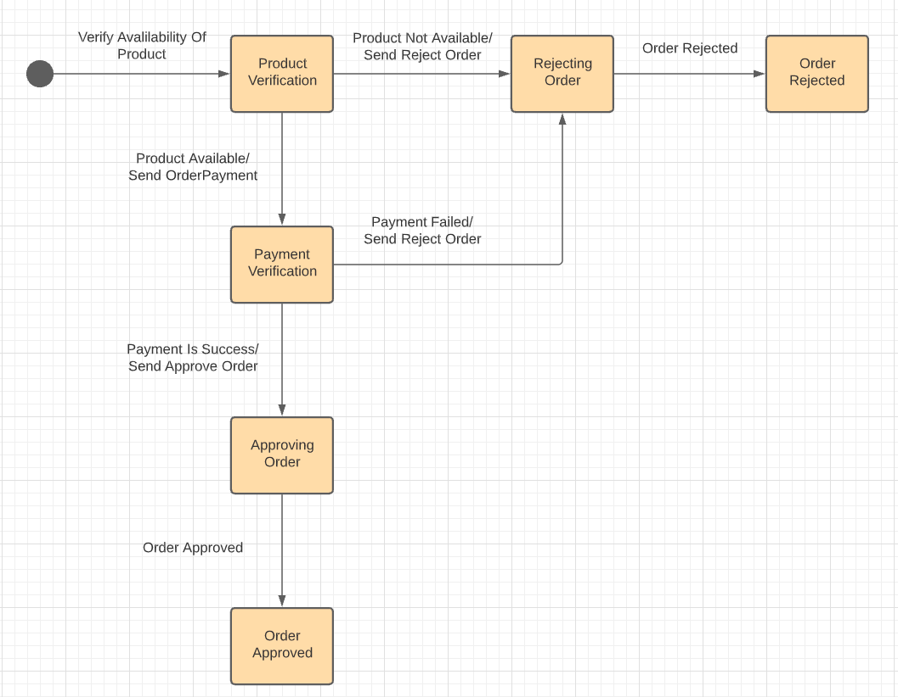

### Orchestration SAGA
When using orchestration, you define an orchestrator service/class whose sole responsibility is to tell the saga participants
what to do. The saga orchestrator communicates with the participants using command/ async reply-style interaction. To execute 
a saga step, it sends a command message to a participant telling it what operation to perform. After the saga participant has 
performed the operation, it sends a reply message to the orchestrator. The orchestrator then processes the message and determines 
which saga step to perform next.

**Note** : Orchestrator can be a seperate microservice itself or it can reside in one of the microservice where the request first 
reaches. In our case we will have dedicated microservice for dealing with Orchestration SAGA.

Below image shows the design of the orchestration-based version of the Create Order Saga . The saga is orchestrated by the 
CreateOrderSaga in Orchestrtion microservice, which invokes the saga participants using asynchronous request/response. This 
service keeps track of the process and sends command messages to saga participants, such as Order Service, Product Service and
Payment Service . The CreateOrderSaga, reads reply messages from its reply channel and then determines the next step, if any, 
in the saga.

Order Service first initiates Create Order Saga orchestrator. After that, the flow for the happy path is as follows:
1. The saga orchestrator sends a **create order initiation** command to Order Service.
2. Order Service replies with a  **order initiated** message.
3. The saga orchestrator sends a **verify products availability** command to Product Service.
4. Product Service replies with a  **Products avialble** message.
5. The saga orchestrator sends a **start payment** command to Payment Service.
6. Payment Service replies with a  **payment made** message.
7. The saga orchestrator sends a **approve Order** command to Order Service.
8. Order Service replies with a  **order approved** message.

We have discussed one of the flow in **CreateOrderSage**, but a saga is likely to have numerous scenarios. For example, the 
**CreateOrderSaga** has **two** more scenarios. In addition to the happy path, the saga can fail due to a failure in either 
**Product Service** or **Payment Service** . It’s useful, therefore, to model a saga as a state machine, because it describes 
all possible scenarios.

### Modelling SAGA Orchestrators as State Machines
A good way to model a saga orchestrator is as a state machine. A state machine consists of a set of states and a set of transitions
between states that are triggered by events. Each transition can have an action, which for a saga is the invocation of a saga 
participant. The transitions between states are triggered by the completion of a local transaction performed by a saga participant.
The current state and the specific outcome of the local transaction determine the state transition and what action, if any, to 
perform. There are also effective testing strategies for state machines. As a result, using a state machine model makes designing,
implementing, and testing sagas easier.

Below image shows the state machine model for the **CreateOrderSaga**

**NOte** : When Order Service initiates the CreateOrderSaga, first state in this flow is CreateOrderSaga sending command to Order Service to initiate the Order Creation by inserting the state **(APPROVAL_PENDING)** in its local database. As this step is always
successfull we will not represented this state in the above diagram.

### SAGA Orchestration and Transactional Messaging
Each step of an orchestration-based saga consists of a service updating a database and publishing a message. For example **CreateOrderSaga** orchestrator sends a message to the first saga participant **Order Service** to initiate the order creation 
initiation. Order Service handles a command message by updating its database and sending a reply message. A service must use **transactional messaging** in order to atomically update the database and publish messages.

### Benifits and Drawbacks of Orchestration-Based SAGA's
Orchestration-based sagas have several benefits:
- *Simpler dependencies*: One benefit of orchestration is that it doesn’t introduce cyclic dependencies. The saga orchestrator invokes the saga participants, but the participants don’t invoke the orchestrator. As a result, the orchestrator depends on the participants but not vice versa, and so there are no cyclic dependencies.
- *Less coupling*: Each service implements an API that is invoked by the orchestrator, so it does not need to know about the events published by the saga participants.
- *Improves separation of concerns and simplifies the business logic*: The saga coordination logic is localized in the saga orchestrator. The domain objects are simpler and have no knowledge of the sagas that they participate in. For example, when using orchestration, the Order class has no knowledge of any of the sagas, so it has a simpler state machine model. During the execution of the Create Order Saga , it transitions directly from the APPROVAL_PENDING state to the APPROVED state. The Order class doesn’t have any intermediate states corresponding to the steps of the saga. As a result, the business is much simpler.

